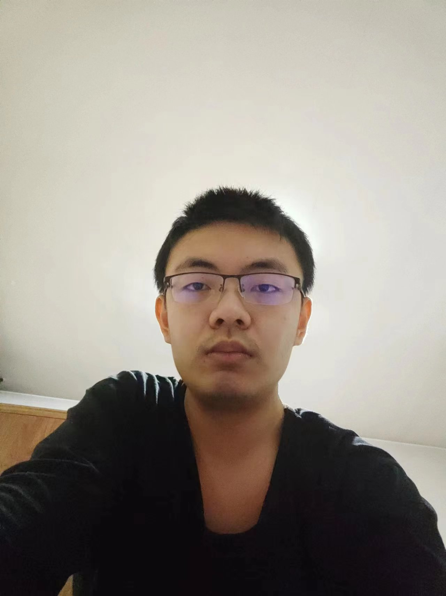

# Tianyu Guo (郭天宇)

E-mail : guoty9[at]mail2.sysu.edu.cn

## Education Experience

| year        | university             | degree        |
| ----------- | ---------------------- | ------------- |
| 2018 - 2022 | Xidian University      | B.S. |
| 2022 - now  | Sun Yat-Sen University | Master      |

## Personal Web

- [CSDN](https://blog.csdn.net/gtyinstinct)
- [Github](https://github.com/gty111)
- [Leetcode](https://leetcode.cn/u/gtyinstinctx/)

## Experience

- Teaching Assistant of "SYSU-DCS3013 : Computer Architecture" [2022f]
  
  > release [SYSU-ARCH LAB](https://arcsysu.github.io/SYSU-ARCH)

## Research

- [Bachelor's dissertation](doc/Bachelor's dissertation.pdf) “General Computing optimization for GPU based on Cache management”

- [AI final HW](doc/A%20Convolutional%20Neural%20Network%20Framework%20support%20on%20CPU%20and%20GPU.pdf) "A Convolutional Neural Network Framework
support on CPU and GPU"
