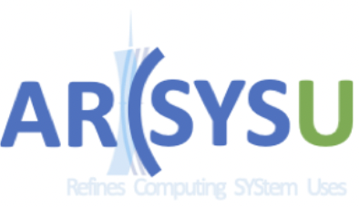

E-mail : guoty9[at]mail2.sysu.edu.cn

---

## About

I'm a third-year PH.D. student of Computer Science and Technology at [Sun Yat-Sen University](https://www.sysu.edu.cn/) co-advised by Assoc. Prof. [Xianwei Zhang](https://xianweiz.github.io/) and Prof. [Nong Xiao](https://cse.sysu.edu.cn/content/2484) . I completed bachelor degree at [Xidian University](https://www.xidian.edu.cn/). My reasearch insterest lies in GPU architecture,MLSys and AI Infra. I'm also passionate about the open source community [(Check out my projects/PRs)](https://github.com/gty111). You can also have a look at my **[RESUME](doc/resume.pdf)** for more details.  

## Publications

- [\[arXiv\]](https://arxiv.org/abs/2504.14775) [\[Github\]](https://github.com/gty111/gLLM) 
gLLM: Global Balanced Pipeline Parallelism System for Distributed LLM Serving with Token Throttling
**Tianyu Guo**, Xianwei Zhang, Jiangsu Du, Zhiguang Chen, Nong Xiao, Yutong Lu

- [Euro-Par'25] [\[arXiv\]](https://arxiv.org/abs/2505.21889) [\[Github\]](https://github.com/gty111/EFIM)
[EFIM: Efficient Serving of LLMs for Infilling Tasks with Improved KV Cache Reuse]()
**Tianyu Guo**, Hande Dong, Yichong Leng, Feng Liu, Cheater Lin, Nong Xiao and Xianwei Zhang, The 31st International European Conference on Parallel and Distributed Processing, Dresden, Germany, August 2025.

- [ASP-DAC'25] [\[DOI\]](https://doi.org/10.1145/3658617.3697568) 
[Mpache: Interaction Aware Multi-level Cache Bypassing on GPUs](doc/mpache_aspdac25.pdf) 
Mengyue Xi, **Tianyu Guo**, Xuanteng Huang, Zejia Lin, Xianwei Zhang, The 30th Asia and South Pacific Design Automation Conference, Tokyo Odaiba Miraikan, Japan, January 2025.

- [DAC'24] [\[DOI\]](https://doi.org/10.1145/3649329.3655906) [\[Slide\]](doc/DAC_slide.pdf)  
[SMILE: LLC-based Shared Memory Expansion to Improve GPU Thread Level Parallelism](doc/DAC_24_L2.pdf)   
**Tianyu Guo**, Xuanteng Huang, Kan Wu, Xianwei Zhang and Nong Xiao, The 61st ACM/IEEE Design Automation Conference, San Francisco, CA, United States, June 2024.

## Experience

 
2024.01 - 2024.06

- Research intern at [Tencent](https://www.tencent.com/) 
    - [\[CrossKV\]](doc/CrossKV-pre.pdf)[\[KVsail\]](doc/KVsail.pdf) KV cache reuse and offloading
    - LLMs inference systems with extreme performance

 
2023.08 - 2023.12

- Participate and win the 2nd prize of A3 track in the 1st [ACTIC](http://www.ac-innovation.com) 
    - [\[Preliminary\]](doc/ACTIC_preliminary_presentation.pdf)/[\[Final\]](doc/ACTIC_Final_Presentation.pdf) Presentations and [\[Technical Report\]](doc/ACTIC_tech_report.pdf)
    - Operator implementation and performance optimization with vector instruction set

 
2022.10 - 2023.01

- Teaching Assistant of ["SYSU-DCS3013 : Computer Architecture"](https://arcsysu.github.io/teach/dcs3013/f2022.html) 
    - Release [\[SYSU-ARCH LAB\]](https://arcsysu.github.io/SYSU-ARCH) that focuses on the use and extending of simulators

## Projects

- [Optimize GEMM step by step](https://gty111.github.io/2023/06/20/gemm-optimize/)

- [PTX-EMU: A simple emulator for CUDA program](https://github.com/gty111/PTX-EMU)

- [A simple CNN training framework support on CPU and GPU(CUDNN)](https://github.com/gty111/ConvNN)

- [GEMM by CUDA WMMA (tensor core)](https://github.com/gty111/GEMM_WMMA)

- [Mouse Controler(APP): Use your phone as a mouse](https://github.com/gty111/Mouse-Controler)

- [eChat(APP): A simple Internet chatroom](https://github.com/gty111/eChat)

- [BCI: Web interface for mindwave MOBILE2(NeuroSky)](https://github.com/gty111/BCI)

## Presentations & HW & Dissertation

- [Work report 24 summer](doc/work%20report%2024s.pdf)

- [Weekly Paper Sharing SC23](doc/Frontier.pdf) "Frontier: Exploring Exascale"

- [Weekly Paper Sharing MLSYS23](doc/paper-sharing-mlsys23.pdf) "AUTOSCRATCH: ML-OPTIMIZED CACHE MANAGEMENT FOR INFERENCE-ORIENTED GPUS"

- [Work report 22-23](doc/work%20report%2022-23.pdf) 

- [Weekly Paper Sharing HPCA23](doc/paper-sharing-hpca23.pdf) "DIMM-Link: Enabling Efficient Inter-DIMM Communication for Near-Memory Processing"

- [AI final Homework](doc/A%20Convolutional%20Neural%20Network%20Framework%20support%20on%20CPU%20and%20GPU.pdf) "A Convolutional Neural Network Framework support on CPU and GPU"

- [Bachelor's dissertation](doc/Bachelor's%20dissertation.pdf) “General Computing optimization for GPU based on Cache management”

